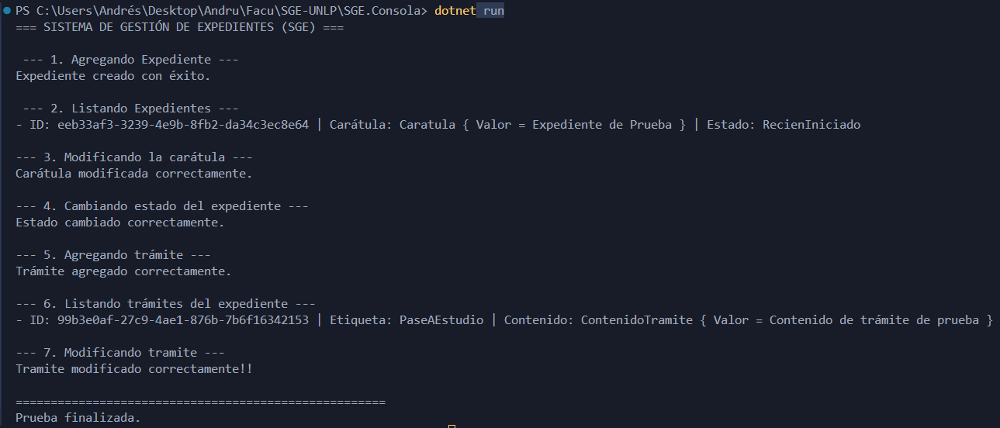
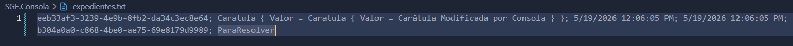
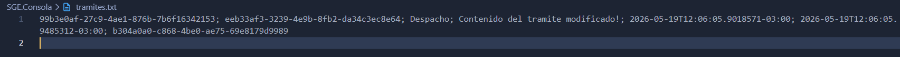
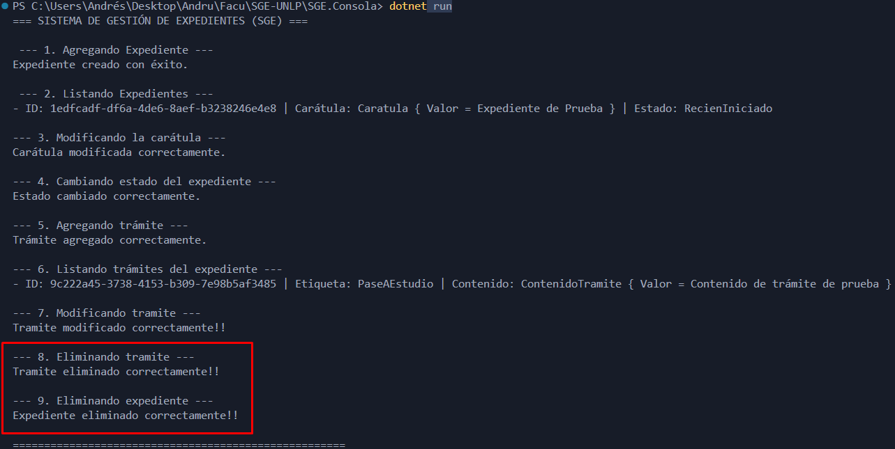

# Sistema de Gestión de Expedientes (SGE)

Este proyecto es una implementación de un Sistema de Gestión de Expedientes (SGE) desarrollado en .NET, aplicando los principios de **Arquitectura Limpia (Clean Architecture)** y **Diseño Guiado por el Dominio (DDD)**.

## 🚀 Instrucciones de Ejecución

Para probar el software y ver su funcionamiento en la consola, seguí estos pasos:

1. Abrí tu terminal
2. Posicionate dentro de la carpeta del proyecto, y luego en la carpeta de consola:
   cd SGE.Consola
3. Ejecutá el proyecto con el siguiente comando:
    dotnet run
4. Una vez que el programa termine de ejecutarse, podés abrir los archivos expedientes.txt y tramites.txt generados en esa misma carpeta para corroborar cómo se guardaron y modificaron los datos en tiempo real.

🛑 ¡CONSIDERACIÓN IMPORTANTE PARA LA PRUEBA! 🛑

El archivo Program.cs está configurado para ejecutar todos los Casos de Uso de corrido como una demostración completa. Esto incluye los casos de uso de Eliminar Expediente y Eliminar Trámite al final de la ejecución.

Si querés inspeccionar los archivos .txt y ver los datos persistidos, DEBÉS COMENTAR las líneas de código correspondientes a la eliminación en el Program.cs antes de ejecutar "dotnet run" (PASO 3). De lo contrario, el programa creará, modificará y finalmente eliminará los registros tan rápido que los archivos .txt quedarán vacíos al finalizar.

## 🧪 Pruebas de Funcionalidad (`Program.cs`)

A continuación, se detalla cómo el `Program.cs` orquesta la prueba de todas las funcionalidades del sistema:

### 1. Alta de Expedientes
El sistema permite crear un expediente nuevo validando que el usuario tenga los permisos necesarios.

### 2. Listado de Expedientes
Se recuperan todos los expedientes desde el repositorio de texto plano.

### 3. Modificación de Carátula y Cambio de Estado
Se prueba la mutación de la entidad.

### 4. Gestión de Trámites (Alta y Efecto Cascada)
Al agregar un trámite a un expediente existente.

### 5. Modificación de Trámites
Se actualiza la etiqueta y el contenido de un trámite

### 6. Baja de Expedientes y Trámites (Eliminación)
El sistema prueba la eliminación de un trámite.

Salida esperada:

expedientes.txt:

tramites.txt:

Eliminación en cascada:

